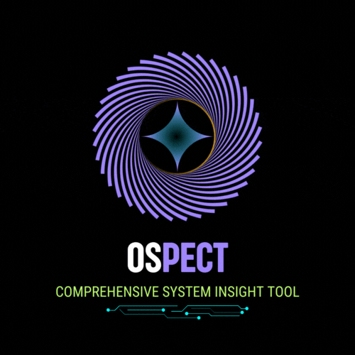

# OSpect: Comprehensive System Diagnostics and Insights


## Overview

<div style="display: flex; align-items: center; justify-content: space-between;">
  <p style="text-align: justify;">
    OSpect is a high-performance versatile system diagnostics and insights tool written in Rust, designed for detailed exploration of operating system configurations, hardware components, and network status. With its focus on speed and security, OSpect is ideal for developers, system administrators, and users who want efficient and in-depth diagnostics.
  </p>

  

</div>

## Key Features
- **Blazing-fast Execution**: Thanks to Rust’s zero-cost abstractions and memory safety.
- **Detailed System Diagnostics**: Get comprehensive OS, hardware, and network information.
- **Customizable**: Fine-tune the output for specific needs using config file.
- **Cross-Platform Capabilities**: Seamlessly compatible with Linux, Windows, and macOS for a unified experience across all major platforms.
- **Secure**: No data leakage, with all diagnostics performed locally.
- **Visual Appeal**: Clean and colorful output designed for readability and ease of use.

## Installation

### Automated Install Script

To simplify the installation process, you can use the provided `install_ospect.sh` script (for Unix-based Systems) or `install_ospect.bat` (for Windows Systems). This script will install Rust, clone the OSpect repository, build the project, and run OSpect along with env. variable additions.

1. **Download and Run the Script**:

   [***For `Unix-Based` Systems***]
   ```sh
   curl -O https://raw.githubusercontent.com/Coder-Harshit/OSpect/main/install_ospect.sh
   chmod +x install_ospect.sh
   sudo ./install_ospect.sh
   ```

   [***For `Windows` Systems***]
   ```sh
   curl -O https://raw.githubusercontent.com/Coder-Harshit/OSpect/main/install_ospect.bat
   ./install_ospect.bat
   ```
   > Manual intervention may be involved in case of windows systems

### Manual Installation

If you prefer to manually install OSpect, follow these steps:

1. **Install Rust and Cargo**: If you don't have Rust and Cargo installed, you can get them from [rustup.rs](https://rustup.rs/).

2. **Clone the Repository**:
   ```sh
   git clone https://github.com/Coder-Harshit/OSpect.git
   cd OSpect
   ```

3. **Build and Install**:
   ```sh
   cargo build --release
   cargo install --path .
   ```

## Usage
Run OSpect to get a detailed system overview:

```sh
ospect
```

**Command-Line Options**

OSpect provides the ability to display specific system information via additional parameters. Here are some examples:

- **Show Basic System Analytics**:
  ```sh
  ospect basic
  ```

- **Show Network Analytics**:
  ```sh
  ospect network
  ```

<!-- - **Show Detailed Hardware Analytics**:
  ```sh
  ospect hardware
  ``` -->

- **Show Detailed OS Analytics**:
  ```sh
  ospect os
  ```

<!-- - **Show Version Information**:
  ```sh
  ospect --version
  ```
- **Display Help**:
  ```
  ospect --help
  ``` -->

## 💡 Configuration

You can configure OSpect’s output through environment variables or modify the configuration file (`config.toml`). A sample config file is provided in the repository for demonstration purposes.

Example `config.toml`:

```toml
[basic]
username
total_memory

[os]
hostname
kernel

```

## 🛡️ Security

OSpect is designed with a strong emphasis on security. All diagnostics are run locally, and no external connections are made, ensuring that sensitive data is not exposed.

## 🤝 Contributing

We welcome contributions from the community! If you'd like to contribute to OSpect, please follow these steps:

1. **Fork the Repository**: Click the "Fork" button at the top of this page.

2. **Clone Your Fork**:
   ```sh
   git clone https://github.com/<your-username>/OSpect.git
   cd OSpect
   ```

3. **Create a Feature Branch**:
   ```sh
   git checkout -b feature-branch
   ```

4. **Make Your Changes**: Implement your feature or fix the bug.

5. **Commit and Push**:
   ```sh
   git add .
   git commit -m "Description of your changes"
   git push origin feature-branch
   ```

6. **Create a Pull Request**: Open a pull request from your forked repository's feature branch to the main repository's main branch.

## License

This project is licensed under the MIT License. See the [LICENSE](LICENSE) file for more details.

## Contact

For questions or feedback, please contact [harshitvj07@gmail.com](mailto:harshitvj07@gmail.com).

---

Thank you for using OSpect! We hope you find it as useful and powerful as we do.
